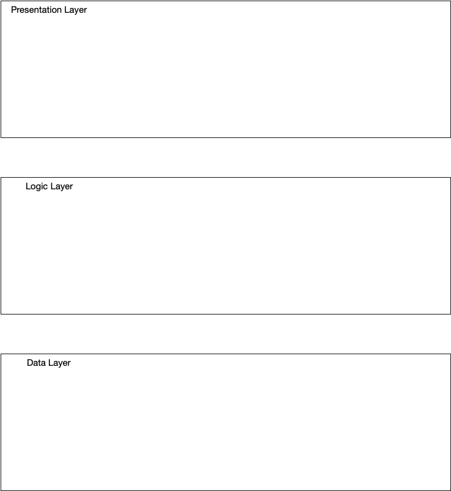

# Iteration 1

## 1.1 ADD Step 1: Review Inputs

Primary Functional Requirements:
- UC-1,2: Registering Students & Professors
- UC-3: Managing Courses
- UC-4: User administration and log in

Quality Attribute Scenarios:

In addition to these use cases, a number of quality attribute scenarios were elicited and documented. The six most relevant ones are presented in the following table. For each scenario, we also identify the use case that it is associated with.

| ID | Quality Attribute | Scenario | Associated Use Case |
| -  | - | - | - |
| QA-1 | Availability | The system should be able to always be accessible regardless of the load on the server | All |
| QA-2 | Performance  | A course’s information requires an update during peak registration times. Once the necessary changes are made, the system should be able to update quickly and efficiently, within 5 seconds for all users | UC-3 |
| QA-3 | Security | An unknown user attempts to login to another account without the proper credentials. The system logs these unsuccessful attempts to be viewed by a system administrator. | UC-4 |
| QA-4 | Scalability | As the university grows, the student body, number of professors, programs and course offerings will all increase. The system is able to handle the increasing demand. | All |
| QA-5 | Modifiability | A new elective is added to the database's selection of courses over the summer. This course is added successfully without affecting any of the system's core components. | UC-1, UC-2 |

| Scenario ID | Importance to the Customer | Difficulty of Implementation | Associated Use Case |
| - | - | - | - |
| QA-1 | HIGH | MEDIUM | UC-1,2 |
| QA-2 | HIGH | MEDIUM | UC-3 |
| QA-3 | HIGH | MEDIUM | UC-4 |
| QA-4 | MEDIUM | LOW | UC-1 |
| QA-5 | MEDIUM | LOW | UC-1,2 |

## 1.2 Iteration 1: Establishing an Overall System Structure
## 1.2.1 Step 2: Establish Iteration Goal by Selecting Drivers

This is the first iteration in the design of our university database management system, so the iteration goal is to achieve the architectural concern CNR-1 of establishing an overall system structure.
Although this iteration is driven by a general architectural concern, we must keep in mind all of the drivers that may influence the general structure of the system. In particular, we must be mindful of the following:

- QA-1: Availability
- QA-2: Performance 
- QA-3: Security
- QA-4: Scalability
- QA-5: Modifiability
- CON-1: The system must be accessed through a web browser running on a Windows 10 or higher platform
- CON-2: A relational database server must be used.
- CON-3: Only administrative accounts can have authorization to change grades.

## 1.2.2 Step 3: Choose One or More Elements of the System to Refine

This is a university database development effort, so in this case the element to refine is the entire University DBMS system, which is shown in the context diagram above. Refinement is performed through decomposition.

## 1.2.3 Step 4: Choose One or More Design Concepts That Satisfy the Selected Drivers

| Design Decisions and Location | Rationale |
| -- | ---------- |
| Web Application | The decision of classifying this as a web application is due to the fact that the user will use a web browser to access the application. |
| Three-Tier Deployment Pattern | The decision to use a three-tier deployment is because the project will consist of the server backend, the database to store users and data and the client web application for the UI component. |
| | Discarded Alternatives <table><tr><th>Alternative</th><th>Reason for Discarding</th></tr><tr><th>Mobile application</th><th>Too limited for the scope of the project! A full desktop experience in the browser is needed</th></tr><tr><th>Rich Internet Application </th><th>Security concerns</th></tr><tr><th>Rich Client</th><th>Does not run in web browser, interacts with desktop OS and can only access local databases</th></tr></table> |

## 1.2.3 Step 5: Instantiate Architectural Elements, Allocate Responsibilities, and Define Interfaces

| Design Decisions and Location | Rationale |
| -- | ---------- |
| Store data on the network | There is no need to store the data locally as the users will need to access them at any time, so the best solution is to use the network. |
| Host the the web application on a different server | This will help with security and will help with performance for the data server. |

## 1.2.5 Step 6: Sketch Views and Record Design Decisions

Figure 1.1

| Element | Responsibility |
| - | - |
| User Workstation | User PC, hosts client side logic of the system. |
| System Server | Server that serves web pages as well as hosting all server side logic of the system. |
| Database Server | Server that hosts the legacy relational database. |

Figure 1.2

## 1.2.6 Step 7: Perform Analysis of Current Design and Review Iteration

| Not Addressed | Partially Addressed | Completely Addressed | Design Decisions Made During the Iteration | 
| ------------- | ------------------- | -------------------- | ------------------------------------------ |
| | UC-1 | | Uses a three tier deployment pattern and web application to register students at real time.  |
| | UC-2 | | Uses a three tier deployment pattern and web application to register students at real time.  |
| | UC-3 | | Uses a three tier deployment pattern and web application to allow management and access from anywhere. No decisions have been on what technology to use for the dashboard.  |
| | UC-4 | | Uses a three tier deployment pattern and web application to allow users to access the website. |
| QA-1 | | | No decisions made.  |
| | QA-2 | | The system performance has been identified. |
| | QA-3 | | The system security has been identified  |
| QA-4 | | | No decisions made.|
| QA-5 | | | No decisions made.|
