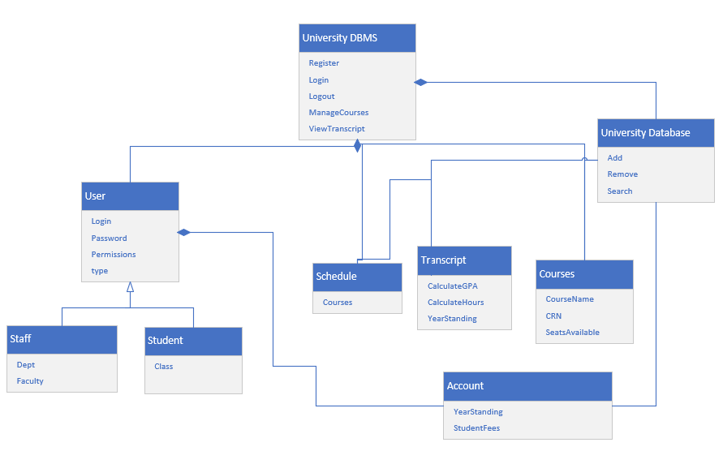
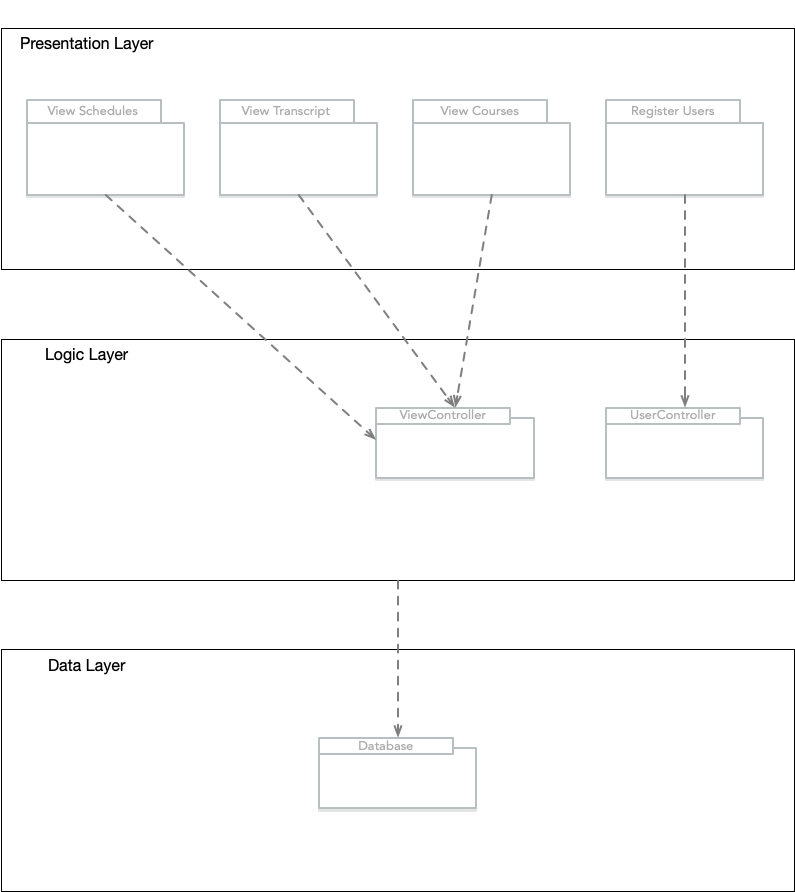
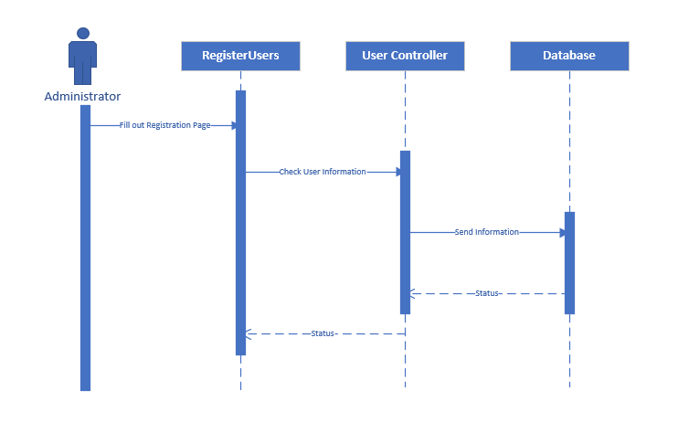

# Iteration 2

## 2.2 Iteration 2: Identifying Structures to Support Primary Functionality

## 2.2.1 Step 2: Establish Iteration Goal by Selecting Drivers

The goal of this iteration is to address the general architectural concern of identifying structures to support primary functionality. Identifying these elements is useful not only for understanding how functionality is supported, but also for addressing the allocation of work to members of the development team. In this second iteration, the architect considers the system's primary use cases:

- UC-1: Register Students
- UC-3: Manage Courses
- UC-6: View Schedule

## 2.2.2 Step 3: Choose One or More Elements of the System to Refine

The elements that will be refined in this iteration are the modules located in the different layers defined by the two reference architectures from the previous iteration. In general, the support of functionality in this system requires the collaboration of components associated with modules that are located in the different layers. 

## 2.2.3  Step 4: Choose One or More Design Concepts That Satisfy the Selected Drivers

In this iteration, several design concepts, in this case architectural design patterns, are selected.  The following table summarizes the design decisions. The words in bold in the following table  refer to architectural patterns.

| Design Decisions and Location | Rationale |
| -- | ---------- |
| Create a **Domain Model** for the application | Before the functional decomposition can start, it is necessary to create an initial domain model for the system. This model will identify the major entities in the domain and their relationships. |
| Identify **Domain Objects** that map to functional requirements | Each distinct functional element of the application needs to be encapsulated in a self-contained building block - a domain object. |
| Decompose **Domain Objects** into general and specialized **Components** | Domain objects represent complete sets of functionality, but this functionality is supported by finer-grained elements located within the layers. The "components" in this pattern are what we have referred to as modules. Specialization of modules is associated with the layers where they are located. |

## 2.2.4 Step 5: Instantiate Architectural Elements, Allocate Responsibilities, and Define Interfaces

The instantiation design decisions made in this iteration are summarized in the following table:

| Design Decisions and Location | Rationale |
| -- | ---------- |
| Create only an initial domain model | The entities that participate in the primary use cases need to be identified and modeled but only an initial domain model is created, to accelerate this phase of design. |
| Map the system use cases to domain objects | An initial identification of domain objects can  be made by analyzing the system's use cases. Domain objects are identified for all of the use cases in the use case model. |
| Decompose the domain objects across the layers to identify layer-specific modules with an explicit interface | This technique ensures that modules that support all of the functionalities are identified. The architect will perform this task just for the primary use cases. This allows another team  member to identify the rest of the modules, thereby allocating work among team members. Having established the set of modules, the architect realizes the need to test these modules, so a new architectural concern is identified here: CRN: A majority of modules shall be unit tested. Only "a majority of modules" are covered by this concern because the modules that implement user interface functionality are difficult to test independently.

## 2.2.5 Step 6: Sketch Views and Record Design Decisions

Several Diagrams were created as a result of decisions made in step 5.
- Figure 2.1 shows an initial domain model for the system.
- Figure 2.2 shows the domain objects that are instantiated for the use case model found in the project proposal.
- Figure 2.3 shows the sequence diagram of a primary use case

Figure 2.1

Figure 2.2

Figure 2.3

## 2.2.6 Step 7: Perform Analysis of Current Design and Review Iteration

The decisions made in this iteration provided an initial understanding of how functionality is supported in the system. The modules associated with the primary use cases were identified by the architect, and the modules associated with the rest of the functionality were identified by  another team member. From the complete list of modules, a work assignment table was created.
Drivers that were completely addressed in the previous iteration are removed from the table.

| Not Addressed | Partially Addressed | Completely Addressed | Design Decisions Made During the Iteration | 
| ------------- | ------------------- | -------------------- | ------------------------------------------ |
| | UC-1 | | Maps the system use cases to a specific module in the presentation layer. | 
| | UC-3 | | Maps the system use cases to a specific module in the presentation layer. | 
| | UC-6 | | Maps the system use cases to a specific module in the presentation layer. | 
| QA-1 | | | No relevant decisions were made | 
| QA-2 | | | No relevant decisions were made | 
| | QA-4 | | The elements that support the associated use case (All) have been identified. |
| | QA-5 | | The elements that support the associated use case (UC-3) have been identified. |
| CON-1 | | | No relevant decisions were made| 
| | CON-2 | | Modules responsible for collecting data storage have been identified. | 
| | CON-3 | | Modules responsible for collecting data storage have been identified. | 
