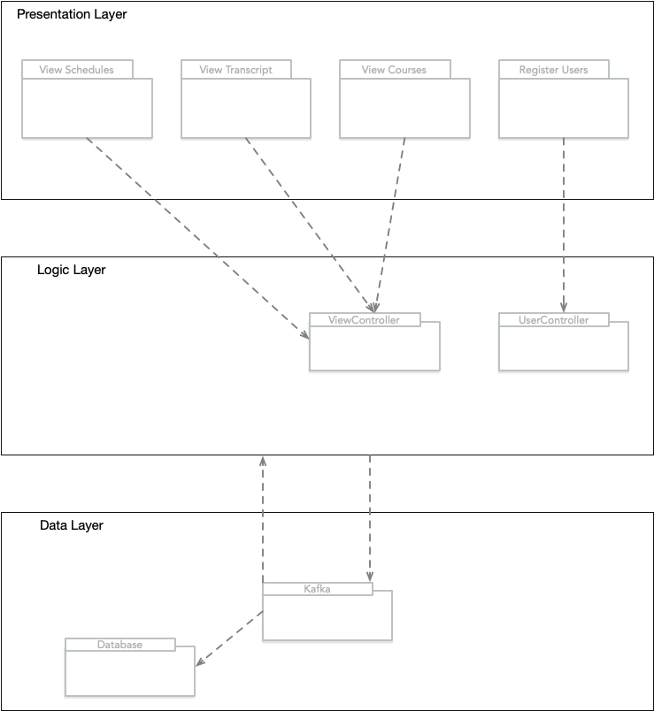
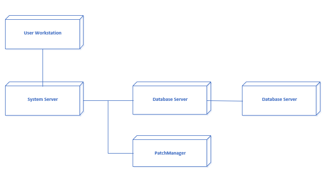

# Iteration 3

## 3.2 Iteration 3: Addressing Quality Attribute Scenario Driver (QA-2)

## 3.2.1 Step 2: Establish Iteration Goal by Selecting Drivers

For this iteration the architect will focus on QA-2 quality attribute scenario: A course’s information requires an update during peak registration times. Once the necessary changes are made, the system should be able to update quickly and efficiently, within 5 seconds for all users.

## 3.2.2 Step 3: Choose One or More Elements of the System to Refine

For this performance scenario, the elements that will be refined are:
- Database server
- Application server

## 3.2.3  Step 4: Choose One or More Design Concepts That Satisfy the Selected Drivers
The Design concepts used in this iteration are as follows:

| Design Decisions and Location | Rationale and Assumptions |
| ----------------------------- | ------------------------- |
| Implement a patch manager to effectively manage the patch update process. | Implementing a patch manager will allow for the automation of updates and much easier management of implemented patches. This will drastically speed up the update process. |
| Introduce an element from the message queue technology family. |Patches received from the patch manager will be placed in a message queue before they are retrieved by the database. The use of a queue will keep server updates in order and processing at a steady pace. We have opted to use apache kafka as the framework for this element. |
| Implement the passive redundancy strategy by replicating the application and core components (i.e. database) | By making redundant copies of all core application components the application can still function normally even in the event of one of the replicated elements failing. | 
## 3.2.4 Step 5: Instantiate Architectural Elements, Allocate Responsibilities, and Define Interfaces

The instantiation design decisions are summarized in the following table:

| Design Decisions and Location | Rationale |
| ----------------------------- | ---------- |
|Implement Kafka as a message queue component. | Kafka is slightly different from other messaging queue services as it allows producers (administration) to publish messages to kafka topics which can then be viewed persistently by consumers (Professors & Students). Using Kafka allows multiple users to process different logic based on single messages published by the producers. |
| Deploy Kafka and patch manager on individual nodes. | The message queue and patch manager will both be deployed on separate nodes. This will ensure that no messages are lost on application failure and patch implementation can be easily rolled back if an error occurs during an update. |
| Implement passive redundancy in the application server. | Implementing passive redundancy will allow the patch manager to update one of the redundant application servers. In the event of a critical error in the patch the application server will immediately copy the state of the first resulting in a quick and efficient rollback of the patch. |

## 3.2.5 Step 6: Sketch Views and Record Design Decisions

Figure 3.1

Figure 3.2

| Element | Responsibility | 
| - | - | 
| Redundant Database Server | Act as a redundant replica of the database server. In the event of a failure during patch implementation or normal operation, the database server will immediately refresh to the state of the replica. |
| Patch Manager | Allow for the streamlining of the implementation and management of patches. Drastically speeding up the update process as per QA-2. |
| Kafka | Act as a message queuing service between the logic and data layers. Allow for producers to publish messages to Kafka topics so consumers can view these messages persistently. |

## 3.2.6 Step 7: Perform Analysis of Current Design and Review Iteration

In this iteration, important design decisions have been made to address QA-2. These decisions also impacted QA-1 and QA-5. The following table summarizes the status of the different drivers and the decisions that were made during the iteration. Drivers that were completely addressed in the previous iteration have been removed from the table.

| Not Addressed | Partially Addressed | Completely Addressed | Design Decisions Made During the Iteration | 
| ------------- | ------------------- | -------------------- | ------------------------------------------ |
| | QA-1 | | Implement the passive redundancy strategy so that the application can still function normally even in the event of one of the replicated elements failing. |
| | QA-2 | | Implement a patch manager to drastically speed up the update process. |
| | QA-5 | | Implement a patch manager to effectively manage the patch update process and allow for much easier management of implemented patches. |
| CON-1 | | | No relevant decision made. |
| CON-2 | | | No relevant decision made.
| |  | CON-3 | Implement Kafka as a message queue component. |
