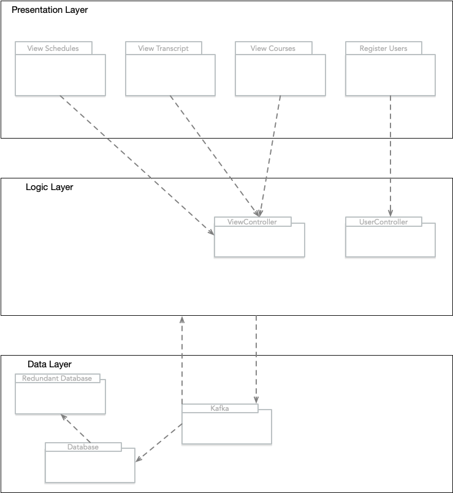

# Iteration 3

## 3.2 Iteration 3: Addressing Quality Attribute Scenario Driver (QA-2)

## 3.2.1 Step 2: Establish Iteration Goal by Selecting Drivers

For this iteration the architect will focus on QA-2 quality attribute scenario: A course’s information requires an update during peak registration times. Once the necessary changes are made, the system should be able to update quickly and efficiently, within 5 seconds for all users.

## 3.2.2 Step 3: Choose One or More Elements of the System to Refine

For this performance scenario, the elements that will be refined are:
- Database server
- Application server

## 3.2.3  Step 4: Choose One or More Design Concepts That Satisfy the Selected Drivers
The Design concepts used in this iteration are as follows:

| Design Decisions and Location | Rationale and Assumptions |
| ----------------------------- | ------------------------- |
| Implement a patch manager to effectively manage the patch update process. | Implementing a patch manager will allow for the automation of updates and much easier management of implemented patches. This will drastically speed up the update process. |
| Introduce an element from the message queue technology family. | Patches received from the patch manager will be placed in a message queue before they are retrieved by the database. The use of a queue will keep server updates in order and processing at a steady pace. |

## 3.2.4 Step 5: Instantiate Architectural Elements, Allocate Responsibilities, and Define Interfaces

The instantiation design decisions are summarized in the following table:

| Design Decisions and Location | Rationale |
| ----------------------------- | ---------- |
| Deploy message queue and patch manager on individual nodes. | The message queue and patch manager will both be deployed on separate nodes. This will ensure that no messages are lost on application failure and patch implementation can be easily rolled back if an error occurs during an update. |
| Implement passive redundancy in the application server. | Implementing passive redundancy will allow the patch manager to update one of the redundant application servers. In the event of a critical error in the patch the application server will immediately copy the state of the first resulting in a quick and efficient rollback of the patch. |

## 3.2.5 Step 6: Sketch Views and Record Design Decisions

## 3.2.6 Step 7: Perform Analysis of Current Design and Review Iteration
