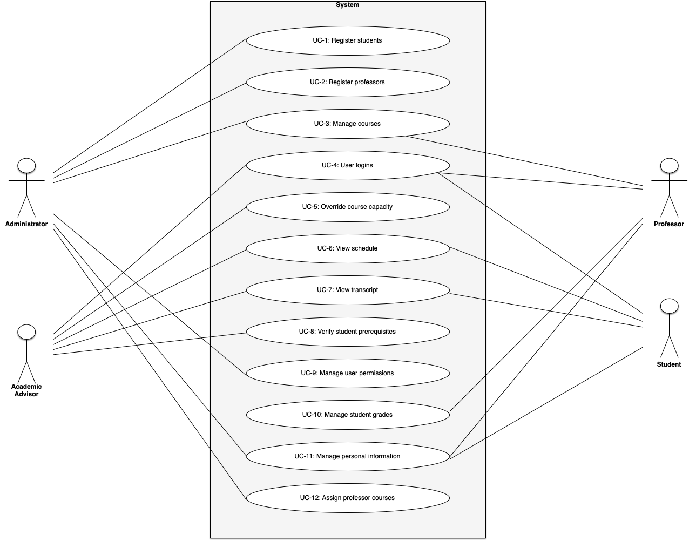

# Use Cases

Each of these use cases is described in the following table:

| Use Case | Description |
| - | - |
| UC-1: Register students | The university database will register and enroll students into their respective programs, faculties, and year-levels, and store attributes such as their name, address, DOB, credit-hours, CGPA and other related personal information. |
| UC-2: Register professors | The database will register professors into the right departments and faculties, and store attributes such as phone number, email, office location/hours, courses currently teaching, and other related information. | 
| UC-3: Manage courses | The system will allow administrators to add/edit/delete courses and manage professors and TAs, while allowing students to register for and drop courses from their schedule. |
| UC-4: User logins | All students, professors, and administrators will each have their own unique set of login credentials in order to access the system according to their role. |
| UC-5: Override course capacity | Administrators will have the power to override course capacities and add students to courses that are full if necessary. | 
| ​​UC-6: View schedule | Students will have the ability to display their schedule for both current and previous semesters for that school year. Academic advisors will also have access to schedules of students under their guidance. |
| UC-7: View transcript | Students will have the ability to display their transcript including active credit hours and overall GPA. Academic advisors will also have access to transcripts of students under their guidance. |
| UC-8: Verify student prerequisites | Academic advisors (who as stated in UC-7 have access to student transcripts), will be able to notify students who have not completed certain prerequisites for courses they wish to register for. |
| UC-9: Manage user permissions | Administrators will be able to edit user permissions for specific professors or students on a case by case basis. |
| UC-10: Manage student grades | Professors will be able to add and modify grades of each student they teach, as well as assign different weightages to different grades according to the course grading breakdown. |
| UC-11: Manage personal information | Students and professors can modify or update specific areas of their personal information stored in the database such as a change in address or phone number. |
| UC-12: Assign professor courses | The system will assign course(s) for specific professors to teach, as well as assign specific professor(s) to deliver different course CRNs. |
